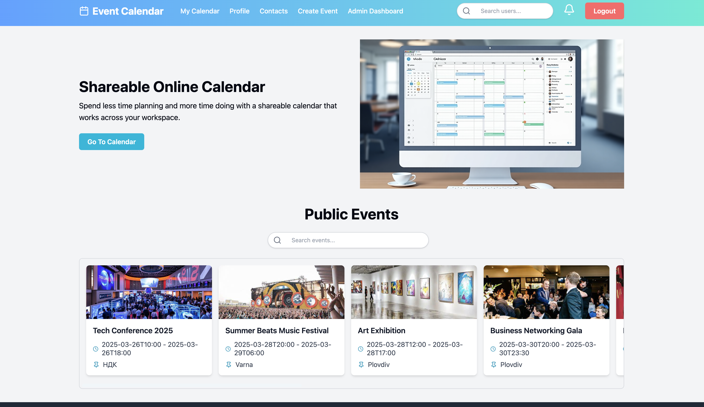
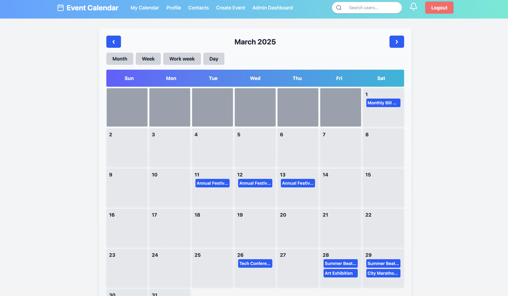
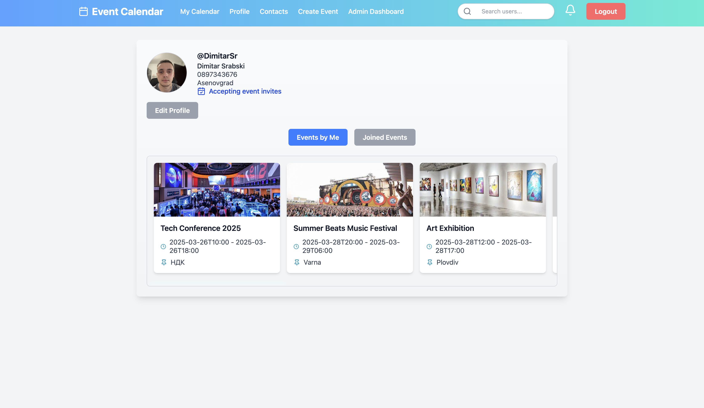
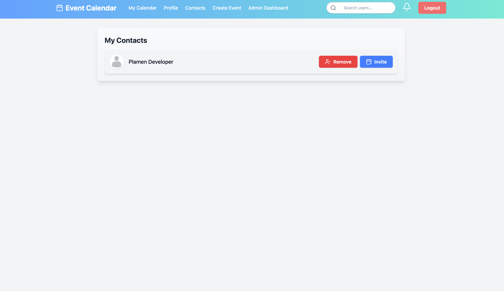
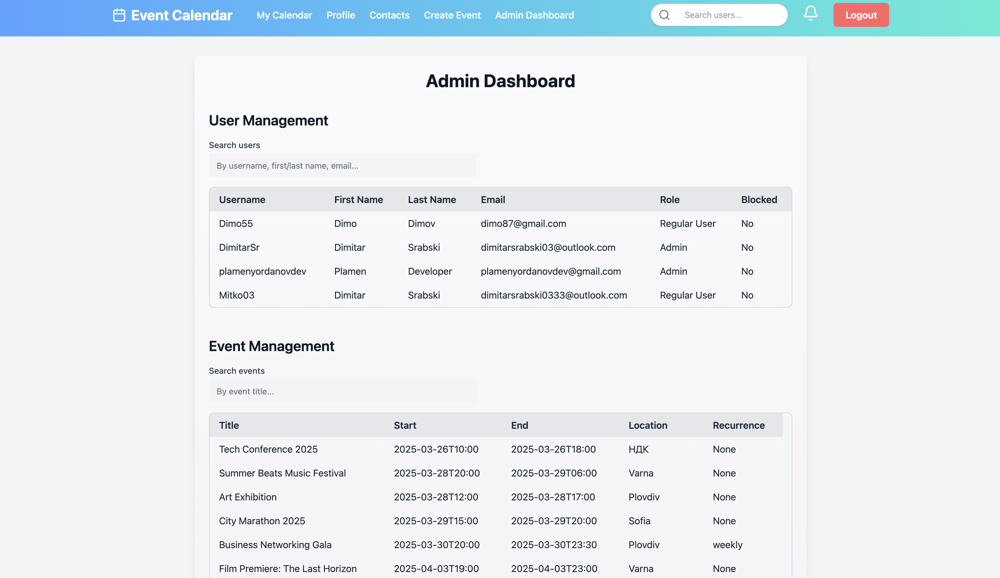
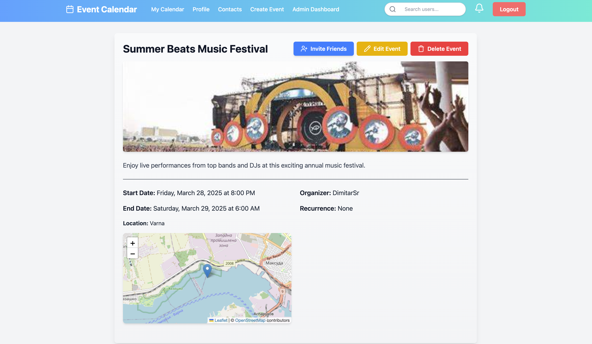

# 📅 Event Calendar – Event Scheduling and Management Web App

## 🧠 Description
Event Calendar is a modern web application for planning and managing events. Designed to support both individual users and teams, it allows users to create events, invite friends, set recurring schedules, and manage their personal calendar with multiple view modes.

## 📸 Screenshots

### 🌐 Landing Page


### 🗓️ My Calendar


### 👤 Profile


### 📇 Contacts


### ⚙️ Admin Dashboard


### 🔍 Single Event View



## 🛠️ Technologies Used
- **Frontend:** React + Vite + TypeScript
- **UI & Styling:** TailwindCSS + DaisyUI
- **Database & Auth:** Firebase (Realtime Database + Authentication)
- **Image Uploads:** Cloudinary

## 🔐 Authentication & User Management
Authentication and registration via Firebase Auth

Each user has:
- Unique username (3–30 characters)
- Email, 10-digit phone number, first and last name, required address, and avatar image
- Profile editing is available (username is not editable)
- User search available only by username
- Friend requests and friend list system
- Option to disable event invitations ("Do not invite me to events")

## 📆 Calendar & Events
Calendar with the following views: Day, Week, Month, Work Week (implemented without third-party calendar libraries)

Event creation and editing with:
- Title, description (up to 500 characters), start and end date/time
- Invite only friends (from contacts)
- Public or private visibility
- Location + event cover image
- Recurrence: daily, weekly, monthly, yearly

## ♻️ Recurring Events
Events support recurrence:
- Daily / Weekly / Monthly / Yearly
- Recurrence can be set during creation or editing

## 🔔 Real-Time Notifications
Notifications triggered in real time via Firebase for:
- Friend requests
- Event invitations

## 📇 Contacts
Users can send and manage friend requests
- Only friends can be invited to events

## 🔍 Public Area (for non-authenticated users)
- Public search for public events
- Login and registration

## 🔐 Private Area (for logged-in users)
- Personal calendar with event views
- Profile editing
- Manage friend and event invitations
- Accept or decline invitations
- Access to all events the user has created or is part of
- Logout redirects to public landing page

## 🛡️ Admin Panel
Accessible only to admin users

Features include:
- Search for users by username
- Pagination for user and event lists
- Clickable user/event items allow:
  - Edit/delete events
  - Block/unblock users

## 🚀 Getting Started
Clone the repository:
```bash
git clone https://github.com/Giphy-App-Team-01/event-calendar-react.git
cd event-calendar-react
```
Install dependencies:
```bash
npm install
```
Create a `.env` file and add your Firebase and Cloudinary config

Start the development server:
```bash
npm run dev
```

## 🔧 Example .env Configuration
```ini
VITE_FIREBASE_API_KEY=your_firebase_api_key
VITE_FIREBASE_AUTH_DOMAIN=your_project.firebaseapp.com
VITE_FIREBASE_PROJECT_ID=your_project_id
VITE_FIREBASE_STORAGE_BUCKET=your_project_storage_bucket
VITE_FIREBASE_MESSAGING_SENDER_ID=your_messaging_sender_id
VITE_FIREBASE_APP_ID=your_firebase_app_id
VITE_FIREBASE_DATABASE_URL=https://your_project_id-default-rtdb.your-region.firebasedatabase.app/

VITE_CLOUDINARY_CLOUD_NAME=your_cloudinary_cloud_name
VITE_CLOUDINARY_UPLOAD_PRESET=your_cloudinary_upload_preset
```
